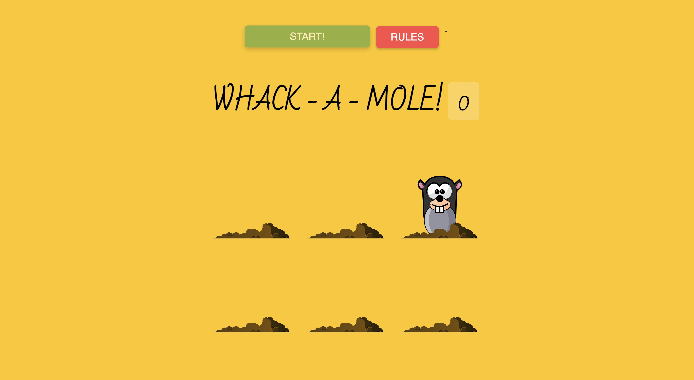

---

<h1 align="center">Whack - A - Mole 🔨</h1>

**Whack-a-Mole** is an exciting, interactive web-based game where the player’s goal is to quickly "whack" moles that randomly pop up from a grid of holes.
The game is built using `HTML`, `CSS`, and `JavaScript`, providing a simple yet enjoyable challenge for players. Every successful click on a mole earns points, testing both the player’s speed and accuracy. 🎮🎯

---

### How to Play 🕹️

1. **[Go here](https://areebamoosa.github.io/Whack-a-Mole)** to access the game.
1. **Press the "Start" button** to begin the game.
1. **Moles will randomly pop up** from the holes on the screen.
1. **Click on as many moles as you can** to increase your score!
1. Your score is displayed at the end, and you can restart the game to beat your own high score.

---

## Technologies 🛠️

- `HTML`
- `CSS`
- `JavaScript`

### 🎥 Demo

---
